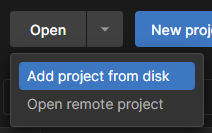
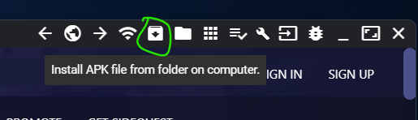
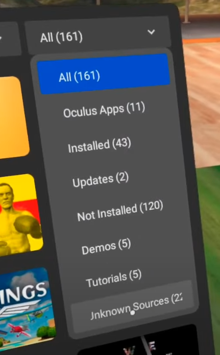

# CS 458/858 Winter 2022: Team Immersion

Our study is focused on benchmarking several different sensori-motor contingencies, as described by [Mel Slater](https://doi.org/10.1098/rstb.2009.0138).

We've compiled an MVP of some of the scenes we developed/tested in our study, which you can download and run on an Oculus Quest HMD.

## Research Study

Due to concerns with the Labour Board, we are currently unable to recruit willing test subjects within our allocated timeframe. Our study will proceed exclusively through evaluation of team members **only**.

*However*, the research effort is not fruitless; follow the steps below and submit your tests results to our [Google Forms page](https://docs.google.com/forms/d/e/1FAIpQLSeGxzlj9T6sS7Eb-iBv1fx6SXkXbc7LtC5ZNrD4rht7bdKMqw/viewform).

### What you'll need
- Oculus HMD + controllers (see installation steps [below](#installation))
- An evaluator (you)
- A willing test subject

<br />

### Method

There are twenty scenes available to choose from, each accessible from the main menu. Each tests includes a Duck Test that will occur at some point throughout the experience.
1. Open the [Google Forms page](https://docs.google.com/forms/d/e/1FAIpQLSeGxzlj9T6sS7Eb-iBv1fx6SXkXbc7LtC5ZNrD4rht7bdKMqw/viewform).
1. Pick a scene, and have the subject enter that scene.
1. Carefully observe the subject, wait for the Duck Test to occur, record the intensity of their reaction (see [Evaluation](#evaluation)).
1. Ask the subject to evaluate their overall presence throughout the experience (see [Auto-Evaluation](#auto-evaluation)).
1. Repeat five times, *making sure* to record both results for each attempt.
1. Submit your results in the [Google Forms page](https://docs.google.com/forms/d/e/1FAIpQLSeGxzlj9T6sS7Eb-iBv1fx6SXkXbc7LtC5ZNrD4rht7bdKMqw/viewform).

We are exclusively researching the 1st and 5th attempts in our study, in order to get an unbiased result, as well as a consistent result (for control).

> Remember, single results may introduce entropy to the overall dataset. Please try and submit results for more than one scene!

---

#### Evaluation
Rate the subjects' physical and audible reaction from 1-5 
1. No discernable reaction
2. Slight reaction, either not sudden or very minor
3. Definite reaction, slight audible reaction
4. Subject continues to respond after the initial reaction
5. *Falls out of chair, removes HMD, etc*

---

#### Auto-Evaluation
Have the subject describe their sense of "being there" from 1-3:
1. "Nothing"
1. "Something"
1. "Good"

<br />

## Installation

### What you'll need

- Oculus Developer account
- Oculus HMD ([dev mode](https://www.youtube.com/watch?v=jB1gwgSpU3E)) + controllers
- A computer with either Unity or SideQuest installed, as well as Blender (?)

> This project may work on other devices, with the appropriate setup.

<br />

### Running in Unity
Clone the repository using:
```
git clone https://github.com/Mexican-Man/458
```
– or download the project as a `.zip` and extract it.
<br /><br />

In Unity Hub, select the dropdown next to open, and select `Add project from disk`.



Open the project using Unity version 2020.3.28f1. Open `File -> Build Settings`.

> You can click `Player Settings`, and check `XR Plug-in Management`, and make sure that `Oculus` (or whichever platform you're using) is checked.
> Also, make sure that your desired platform (Android, in this case) is set in the Build Settings window.

Make sure your Headset is connected (you should see it under `Run Device` in the Build Settings window. Hit `Build And Run`, and the project should start running on your HMD.

<br />

### Running Natively

#### Prebuilt Binary
A prebuilt `.apk` file can be downloaded from the [Releases](https://github.com/Mexican-Man/458/releases) section.

---

#### Building From Source
Follow the [steps for Running in Unity](#running-in-unity). Instead of clicking `Build And Run`, hit `Build`, and save the `.apk` onto your computer. Proceed to the next steps.

> It's worth noting that many of the scenes included in the source are unfinished, and should not be included in evaluation.

---

#### Uploading Via SideQuest
Launch SideQuest and make sure that your Quest HMD is detected. On the top right, click the `Install APK file from folder on computer` button, and upload the aforementioned `.apk` file.



To run the project, equip your headset, open the Apps icon. In the upper right, select the dropdown that says `All(X)`. Then, select `Unknown Sources`. From there, select the uploaded `.apk` file.


